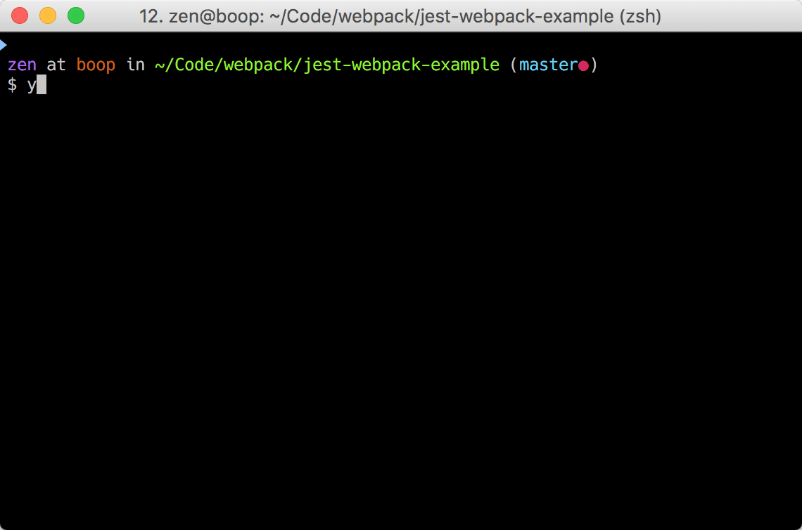

# @mzgoddard/jest-webpack example

A [`@mzgoddard/jest-webpack`](https://github.com/mzgoddard/jest-webpack) example. The tool can be installed in a project that depends on jest and webpack. Wtih an updated package.json test script, you can test with jest with your normal webpack loaders, plugins, aliases and other configuration.

